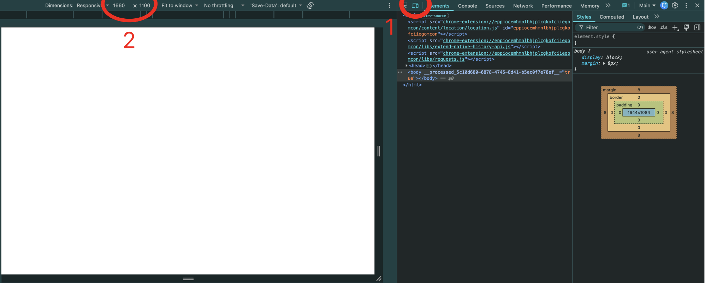

### Ice breaker

### Admin

- [Assessments](https://cgi.cse.unsw.edu.au/~cs6080/26T3/course-outline):
  - Assignment 1 (20%)
  - Quizzes 1, 2, 3 (45%)
    - Short answers
    - BYOD
    - Will be run on COMP6080's [Nous](https://cgi.cse.unsw.edu.au/~cs6080/nous/COMP6080_26T3/home)
    - Bring your **student ID**!!!
    - **Come on time** (unfortunately we're not allowed to let you join after we start)
  - Exam (35%)
    - Short answers
- Quiz 0 next week (W2)
  - Not worth any marks
- **Two weeks worth of content to cover in each non-quiz tute**, so we might have to prioritise some topics over others

### Resources

- [Recs from 6080](https://cgi.cse.unsw.edu.au/~cs6080/26T3/help/resources/htmlcss)
- Picks for HTML
  - [MDN HTML cheatsheet](https://developer.mozilla.org/en-US/docs/Web/HTML/Guides/Cheatsheet)
- Picks for CSS Flexbox
  - [A Complete CSS Flexbox Layout Guide](https://css-tricks.com/snippets/css/a-guide-to-flexbox/)
  - [An Interactive Guide to Flexbox](https://www.joshwcomeau.com/css/interactive-guide-to-flexbox/)

### Assignment 1

- Worth 20%
- Extended by 2 days to compensate for the GitLab issues (due Weds, 30 September 8PM)
  - Check if you have access to the GitLab!
- Quick overview & tips
  - Overlaying reference pictures
    - You can overlay the reference picture for each task with a lower opacity so that it's easier to match. For example, you can use something like this at the start of your HTML:
      ```css
      
      ```
    - **IMPORTANT:** Note that CSS pixels are not always the same as physical screen pixels, so make sure to account/check for that.
    - **IMPORTANT:** Make sure to remove it before submitting, and that it doesn't break your layout.
  - Window sizes
    - Use inspect element in your browser and change the window width and height to match the task. For example, 1660 × 1100 pixels for task 1 (look at your assignment's README.md).
      
    - For task 3, note that you are expected to have reasonable intermediate states: "In other words, if the window size is some combination of widths between 1663 and 440, heights between 3767 and 2000, the page should still reflect the same general structure."
    - From the [spec](https://cgi.cse.unsw.edu.au/~cs6080/26T3/assessments/assignments): "Don't forget to put this code in the head of each webpage you make, to help you on mobile responsive view get the right zoom:"
      ```css
      <meta name="viewport" content="width=device-width, initial-scale=1.0">
      ```
  - Misc
    - For task 3, look into the `@media` rule (for example `@media (max-width: <blabla>px)`) for your transition breakpoints.
    - Don't forget `letter-spacing` might help if text isn't matching up.
  - Code quality
    - Don't forget that code quality makes up half your assignment marks, so make sure to read through the course style guide for [HTML](https://cgi.cse.unsw.edu.au/~cs6080/26T3/style/html) and [CSS](https://cgi.cse.unsw.edu.au/~cs6080/26T3/style/css).
  - Join a [help session](https://cgi.cse.unsw.edu.au/~cs6080/26T3/timetable/help-sessions) if you have any questions!

### Exercises

- [css-generate-simple-box](https://cgi.cse.unsw.edu.au/~cs6080/26T3/content/tutorials/css-generate-simple-box)
- [css-replicate-airbnb](https://cgi.cse.unsw.edu.au/~cs6080/26T3/content/tutorials/css-replicate-airbnb)
- [css-image-backgrounds](https://cgi.cse.unsw.edu.au/~cs6080/26T3/content/tutorials/css-image-backgrounds)
